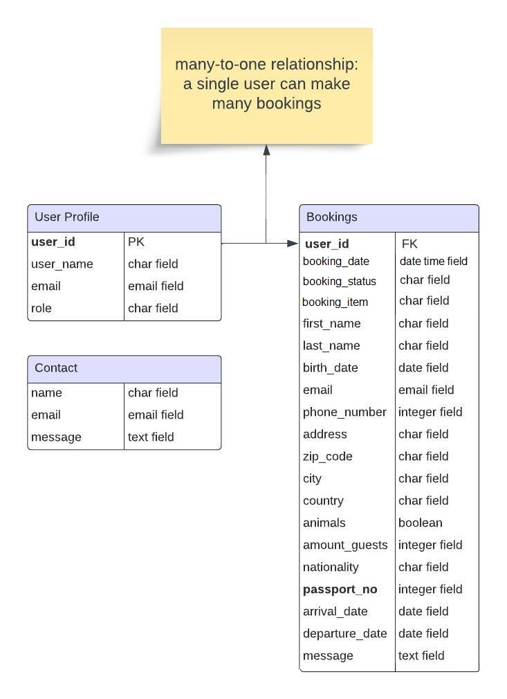

# Code Institute: Full Stack Project by Rafaela Wetzel

The fourth milestone project is about creating a full-stack application and showcasing the HTML, CSS, JS and Python skills I have attained over the past 10 months at Code Institute. It is deployed on Heroku and the fourth out of five projects.  

# Schlosskulm Rental Apartments

I chose to create this application because I know the apartment hosts personally and have visited their charming location in Schlosskulm, Germany. Next to their apartment offer on AirBnB they were also looking for a proper homepage, so I offered my services. I am extra motivated because I know that the project will actually be of real-life use once completed. It is a great way of doing first steps in client work to visualize an idea together and work on the desired features.

# Table of Contents

- [Code Institute: Full Stack Project by Rafaela Wetzel](#code-institute-full-stack-project-by-rafaela-wetzel)
- [Schlosskulm Rental Apartments](#schlosskulm-rental-apartments)
- [Table of Contents](#table-of-contents)
- [Live Demo](#live-demo)
- [Project Goals](#goals)
  - [User Goals](#project-goals)
  - [Site-Owner Goals](#site-owner-goals)
- [User Experience](#user-experience)
  - [Target Audience](#target-audience)
  - [User Stories](#user-stories)
- [Technologies](#technologies)
- [Libraries](#libraries)
- [Design](#design)
  - [Homepage Design](#homepage-design)
- [Features](#features)
  - [Homepage Structure](#homepage-structure)
  - [Main Page](#main-page)
  - [House Section](#house-section)
    - [Upper Apartment Section](#upper-apartment-section)
    - [Lower Apartment Section](#lower-apartment-section)
    - [Rent House Section](#rent-house-section)
    - [House Rules Section](#house-rules-section)
  - [Schloßkulm Section](#schloßkulm-section)
    - [Day Trips Section](#day-trips-section)
    - [Gallery Section](#gallery-section)
    - [Location Section](#location-section)
  - [Booking Section](#booking-section)
    - [Booking Form Section](#booking-form-section)
    - [Your Bookings Section](#your-bookings-section)
    - [All Bookings Section](#all-bookings-section)
  - [About Us Section](#about-us-section)
  - [Contact Section](#contact-section)
  - [Django Authentication](#django-authentication)
    - [Register Section](#register-section)
    - [Login Section](#login-section)
    - [Logout Section](#logout-section)
- [Database Models](#database-models)
  - [Entity Relationship Diagram](#entity-relationship-diagram)
  - [Booking Model](#booking-model)
  - [Contact Model](#contact-model)
- [Features Left to Implement](#features-left-to-implement)
- [Testing](#testing)
  - [Manual Testing](#manual-testing)
  - [Validator Testing](#validator-testing)
  - [Bugs & Problems](#bugs--problems)
  - [Unfixed Bugs](#unfixed-bugs)
- [Deployment](#deployment)
- [Credits](#credits)
  - [Tutorials](#tutorials)
  - [Media](#media)
  - [Acknowledgements](#acknowledgements)

# Live Demo 

  
  
**You can see a deployed version of my app [here](https://schlosskulm-762627e86384.herokuapp.com/)**

# Project Goals

## User Goals

## Site Owner Goals

- As a site owner I can present my accomodation facilities in a nice and appealing way.
- As a site owner I can log in to see an overview of all bookings on the homepage interface as well as in the admin panel.
- As a site owner I can see each bookings' specific details on the homepage interface as well as in the admin panel.
- As a site owner I can confirm, cancel or delete the individual bookings on the homepage interface as well as in the admin panel.
- As a site owner I can receive guest messages if specific questions come up that are not answered on the homepage. 

# User Experience

## Target Audience

The target audience is...

- visitors from Germany who like to travel / are planning a vacation
- people who want to take some time off in a quiet area and enjoy nature
- families who want a big space that offers enough room for everyone and for their children to play
- couples who want to enjoy a romantic weekend in intimate togetherness
- couples or families that are looking for a pet-friendly accomodation
- hiking groups that are looking for a place to stay overnight
- private groups or companies that are looking for a seminar space with accomodation facilities
- groups looking for a space to organize a working retreat

## User Stories

- As a user I can easily find the most important information about the apartments so I can decide if it fits my needs.
- As a user I can see what the house can be used for in general (apart from renting it for vacation) so I can possibly rent it for other activities / contexts.
- As a user I can read about the house rules so I know what to be considerate of.
- As a user I want to know more about the locations surrounding area so I can plan activities for my vacation.
- As a user I want to have practical information so I do not specifically have to ask the hosts or research on my own.
- As a user I can see photo galleries on the homepage that give me a visual impression of the house and its surroundings.
- As a user I can easily find a contact form so I can get answers to my specific questions.
- As a user I am informed that I need to create an account to make a booking.
- As a user I am getting feedback if I have left any field in the booking form blank.
- As a user I can easily find a form to book the apartment(s) / house once I have created an account.
- As a user I can see my booking(s), details I entered and the current booking status.
- As a user I can easily cancel my booking.

# Technologies

- Lucidchart for creating first visual drafts of the homepage structure and its ERD 
- HTML, CSS and Bootstrap for creating and styling the homepage interface
- JavaScript for creating the confirm, cancel and delete booking functionality
- Python & Django for creating apps, the database, login functionality
- Heroku for deploying the project to a live page
- GitHub for storing the code externally

# Libraries

I used the following libraries:

- os module
- django allauth
- django summernote
- django forms

# Design

## Homepage Design

- 
- 
- 

# Features 

# Homepage Structure 

## Main Page

## House Section  

### Upper Apartment Section

### Lower Apartment Section

### Rent House Section

### House Rules Section

## Schloßkulm Section

### Day Trips Section

### Gallery Section

### Location Section

## Booking Section

### Booking Form Section

### Your Bookings Section

### All Bookings Section

## About Us Section

## Contact Section

## Django Authentication

### Sign Up Section

### Login Section

### Logout Section

# Database Models

## Entity Relationship Diagram

## Booking Model

## Contact Model

# Features Left to Implement

# Testing 

## Manual Testing  

| Section Tested | Input To Validate / Functionality To Test | Expected Outcome | Actual Outcome | Pass/Fail |
| -------------- | ----------------- | ---------------- | -------------- | --------- |
| Main Page | Clicking 'play' button on video | Starts muted YouTube video | As expected | Pass |
| Main Page | Clicking 'Schloßkulm Rental Apartments' in the top left | Redirects to start page | As expected | Pass |
| Main Page | Clicking navigation menu elements | Direct to respective pages | As expected | Pass |
| Upper Apartment Section | Clicking on accordion sections | Respective section opens up | As expected | Pass |
| Upper Apartment Section | Clicking on another accordion section whilst one section is already open | Respective new section opens up and the previous one closes | As expected | Pass |
| Upper Apartment Section - Gallery | Clicking on single pictures | Bigger sized picture opens in a new window | As expected | Pass |
| Upper Apartment Section - Prices | A non-logged in user clicks the 'booking' button | A modal opens up that tells them that it is necessary to be logged in to make a booking | As expected | Pass |
| Upper Apartment Section - Prices | Clicking 'close' in modal window | Closes modal | As expected | Pass |
| Upper Apartment Section - Prices | Clicking 'ok' in modal window | Redirects to login page | As expected | Pass |
| Upper Apartment Section - Prices | Logging in after being redirected from prices section | Redirects to booking page | As expected | Pass |
| Upper Apartment Section - Prices | A logged in user clicks the 'booking' button | Redirects to booking page | As expected | Pass |
| Lower Apartment Section | Clicking accordion sections | Respective sections open up | As expected | Pass |
| Lower Apartment Section | Clicking on another accordion section whilst one section is already open | Respective new section opens up and the previous one closes | As expected | Pass |
| Lower Apartment Section - Gallery | Clicking on single pictures | Bigger sized picture opens in a new window | As expected | Pass |
| Lower Apartment Section - Prices | A non-logged in user clicks the 'booking' button | A modal opens up that tells them that it is necessary to be logged in to make a booking | As expected | Pass |
| Lower Apartment Section - Prices | Clicking 'close' in modal window | Closes modal | As expected | Pass |
| Lower Apartment Section - Prices | Clicking 'ok' in modal window | Redirects to login page | As expected | Pass |
| Lower Apartment Section - Prices | Logging in after being redirected from prices section | Redirects to booking page | As expected | Pass |
| Lower Apartment Section - Prices | A logged in user clicks the 'booking' button | Redirects to booking page | As expected | Pass |
| Rent House Section | A non-logged in user clicks the 'booking' button | A modal opens up that tells them that it is necessary to be logged in to make a booking | As expected | Pass |
| Rent House Section | Clicking 'close' in modal window | Closes modal | As expected | Pass |
| Rent House Section | Clicking 'ok' in modal window | Redirects to login page | As expected | Pass |
| Rent House Section | Logging in after being redirected from prices section | Redirects to booking page | As expected | Pass |
| Rent House Section | A logged in user clicks the 'booking' button | Redirects to booking page | As expected | Pass |
| Day Trips Section | Clicking individual links | Opens respective page in a new window | As expected | Pass |
| Gallery Section | Clicking on single pictures | Bigger sized picture opens in a new window | As expected | Pass |
| Location Section | Clicking +/- within Google Map | Zooms in and out | As expected | Pass |
| Location Section | Clicking 'view bigger map' | Opens new Google Maps window showing bigger map | As expected | Pass |
| Booking Form Section | Clicking 'Booking' in navigation menu as non-logged in user | Redirects to login page | As expected | Pass |
| Booking Form Section | Signing in after being redirected from 'Booking' | Redirects to booking form page | As expected | Pass |
| Booking Form Section | Clicking 'Booking' in navigation menu as logged in user | Opens booking form page | As expected | Pass |
| Booking Form Section | Leaving any of the mandatory form fields blank | Booking is not processed yet and user is prompted to fill in the empty field(s) | As expected | Pass |
| Booking Form Section | Entering a non-email address in e-mail field | Message is not sent yet and user is prompted to enter an email address | As expected | Pass |
| Booking Form Section | Sending valid booking request | Redirects to main page and confirmation message is displayed: "Thank you for your booking request. We will be in touch with you soon." | As expected | Pass |
| Booking Form Section | Entering a birth date that lies in the future | Validation error: "Your birth date cannot be in the future!" | | |
| Booking Form Section | Entering an arrival date that lies after the departure date | Validation error: "Your arrival date must be before your departure date!" | | |
| Booking Form Section | Entering the same date for arrival and departure | Validation error: "Your arrival date cannot be the same day as your departure date!" | | |
| Booking Form Section | Entering letters within the date fields | Validation error: "Please enter a valid date." | | |
| Booking Form Section | Entering arrival or departure dates that are in the past | Validation error: "Your booking date cannot be in the past!" | | |
| Your Bookings Section | Logged in guest has sent a valid booking request | 'Your bookings' appears in navigation menu | As expected | Pass |
| Your Bookings Section | Guest has sent a valid booking request | Booking appears on the 'your bookings' page & status is set to 'requested' | As expected | Pass |
| Your Bookings Section | Guest clicks on 'cancel booking' button | Modal appears | As expected | Pass |
| Your Bookings Section | Guest clicks on 'close' within modal | Modal closes, nothing else happens | As expected | Pass |
| Your Bookings Section | Guest clicks on 'cancel booking' button | Booking status is set to 'cancelled' and 'cancel booking' button disappears | As expected | Pass |
| All Bookings Section | Host logs in | 'All bookings' appears in navigation menu | As expected | Pass |
| All Bookings Section | Host logs in | Host can see all bookings made so far | As expected | Pass |
| All Bookings Section | Host clicks on 'confirm booking' button | Modal appears | As expected | Pass |
| All Bookings Section | Host clicks on 'close' within modal | Modal closes, nothing else happens | As expected | Pass |
| All Bookings Section | Host clicks on 'confirm booking' button within modal | Booking status is set to 'confirmed', 'confirm booking' button disappears and message is displayed: "The booking has been confirmed!" | As expected | Pass |
| All Bookings Section | Host clicks on 'cancel booking' button | Modal appears | As expected | Pass |
| All Bookings Section | Host clicks on 'close' within modal | Modal closes, nothing else happens | As expected | Pass |
| All Bookings Section | Host clicks on 'cancel booking' button within modal | Booking status is set to 'cancelled', 'cancel booking' button disappears and message is displayed: "The booking has been cancelled!" | As expected | Pass |
| All Bookings Section | Host clicks on 'delete booking' button | Modal appears | As expected | Pass |
| All Bookings Section | Host clicks on 'close' within modal | Modal closes, nothing else happens | As expected | Pass |
| All Bookings Section | Host clicks on 'delete booking' button within modal | Booking is removed from database and confirmation message is displayed: "The booking has been deleted!" | As expected | Pass |
| Contact Section | Leaving any of the mandatory form fields blank | Message is not sent yet and user is prompted to fill in the empty field(s) | As expected | Pass |
| Contact Section | Entering a non-email address in e-mail field | Message is not sent yet and user is prompted to enter an email address | As expected | Pass |
| Contact Section | User sends valid contact request | Redirects to main page & displays confirmation message: "Thank you for your message. We will be in touch with you soon." | As expected | Pass |

## Validator Testing

- I confirm that no errors were returned when passing through the [CI Python Linter](https://pep8ci.herokuapp.com/).

- I confirm that no errors were returned when passing through [JSHint](https://jshint.com/).

- I confirm that no errors were returned when passing through the [HTML validator](https://validator.w3.org/).

- I confirm that no errors were returned when passing through the [CSS validator](https://jigsaw.w3.org/css-validator/).

## Bugs & Problems

- On the allauth signup page I had a "Forbidden (403). CSRF verification failed. Request aborted. Reason given for failure: CSRF token from POST incorrect." error when trying to register a new user. This error did not appear during login or logout. It took me a while to figure out that the error occured due to the order within the signup.html. First the  was placed before "input type="hidden" name="csrfmiddlewaretoken" value="BBUZLiv[...]"
and after I placed it before the input field everything worked fine again.
      
- When trying to delete a booking as host via the delete button on the all-bookings page there was a bug that a specific booking, e.g. number 95, would be deleted but then a new booking with number 96 would appear on the page but not to be found in the database. I figured out that I still had booking.save() after booking.delete() in my Javascript delete_booking code. 

## Unfixed Bugs

# Deployment

1. Add requirements for deployment in requirements.txt file
2. Log in to Heroku and create new app
3. Add Python and Nodejs Buildpacks
4. Go to deployment section and connect to GitHub account
5. Search for project repository and connect to Heroku
6. Deploy branch via manual deploy

The live project can be found here: https://schlosskulm-762627e86384.herokuapp.com/  

# Credits 

## Code

[1] Login / logout / sign in - code for nav bar adapted from Django Blog walkthrough  

[2] Adding choice field to a model  
https://www.youtube.com/watch?v=iddMtHAV_N0  

[3] Displaying success alert message
https://stackoverflow.com/a/64242550/22894967  

[4] Adding date validators to model DateField
https://stackoverflow.com/a/49240469/22894967  

[5] Slack support for creating confirm / cancel / delete button functionality  
https://app.slack.com/client/T0L30B202/C026PTF46F5  

## Tutorials 

[1] How to make YouTube videos responsive
https://yoast.com/how-to-make-youtube-videos-responsive/  

[2] How to remove Bootstrap nav bar toggler border  
https://stackoverflow.com/questions/50668594/remove-border-color-for-navbar-toggler-hamburger-icon-in-bootstrap-using-css 

[3] How to add custom CSS classes to form fields in Django Allauth
https://stackoverflow.com/a/21387794/22894967  

[4] How to redirect to previous page after login
https://stackoverflow.com/questions/63886066/redirect-back-to-previous-page-after-login-in-django-allauth  

[5] How to make the booking date visible in the admin panel  
https://stackoverflow.com/a/27679566/22894967 

## Media

- Background image taken from [Unsplash](https://unsplash.com/de/fotos/luftaufnahme-des-ozeans-qztBRIrU1FM)
- Favicon: Schlosskulm coat of arms from [municipality homepage](https://www.uhlstaedt-kirchhasel.de/ortsteile/ ) 
- All house and surrounding area photos provided by apartment hosts Anna & Friedel Barth
- German homepage text provided by apartment hosts Anna & Friedel Barth, English translation by me

## Acknowledgements

- Help and feedback from my mentor Oluwafemi Medale
- Readme structure inspired by [hughes84](https://github.com/hughes84/hangman-pp3/blob/main/README.md)