# Code Institute: Full Stack Project by Rafaela Wetzel

The fourth milestone project is about creating a full-stack application with Django and showcasing the HTML, CSS, JavaScript and Python skills I have attained over the past 10 months at Code Institute. It is deployed on Heroku and the fourth out of five projects.  

# Schlosskulm Rental Apartments

I chose to create this application because I know the apartment hosts personally and have visited their charming location in Schlosskulm, Germany. Next to their apartment offer on AirBnB they were also looking for a proper homepage, so I offered my services. I am extra motivated because I know that the project will actually be of real-life use once completed. It is a great way of doing first steps in client work to visualize an idea together and work on the desired features.

# Table of Contents

- [Code Institute: Full Stack Project by Rafaela Wetzel](#code-institute-full-stack-project-by-rafaela-wetzel)
- [Schlosskulm Rental Apartments](#schlosskulm-rental-apartments)
- [Table of Contents](#table-of-contents)
- [Live Demo](#live-demo)
- [Project Goals](#project-goals)
  - [User Goals](#project-goals)
  - [Site-Owner Goals](#site-owner-goals)
- [User Experience](#user-experience)
  - [Target Audience](#target-audience)
  - [User Stories](#user-stories)
  - [Strategy](#strategy)
  - [Scope](#scope)
  - [Structure](#structure)
  - [Skeleton](#skeleton)
    - [Wireframe](#wireframe)
  - [Surface](#surface)
    - [Color Palette](#color-palette)
  - [Accessibility](#accessibility)
    - [Lighthouse Report](#lighthouse-report)
- [Technologies](#technologies)
- [Libraries](#libraries)
- [Features: Homepage Structure](#features-homepage-structure)
  - [Main Page](#main-page)
  - [House Section](#house-section)
    - [Upper And Lower Apartment Sections](#upper-and-lower-apartment-sections)
    - [Rent House Section](#rent-house-section)
    - [House Rules Section](#house-rules-section)
  - [Schloßkulm Section](#schloßkulm-section)
    - [Day Trips Section](#day-trips-section)
    - [Gallery Section](#gallery-section)
    - [Location Section](#location-section)
  - [Booking Section](#booking-section)
    - [Booking Form Section](#booking-form-section)
    - [Your Bookings Section](#your-bookings-section)
    - [All Bookings Section](#all-bookings-section)
  - [About Us Section](#about-us-section)
  - [Contact Section](#contact-section)
- [Database Models](#database-models)
  - [Entity Relationship Diagram](#entity-relationship-diagram)
  - [Booking Model](#booking-model)
  - [Contact Model](#contact-model)
- [Features Left to Implement](#features-left-to-implement)
- [Testing](#testing)
  - [Manual Testing](#manual-testing)
  - [Validator Testing](#validator-testing)
  - [Bugs & Problems](#bugs--problems)
  - [Unfixed Bugs](#unfixed-bugs)
- [Deployment](#deployment)
- [Credits](#credits)
  - [Tutorials](#tutorials)
  - [Media](#media)
  - [Acknowledgements](#acknowledgements)  

[[Back to top]](#table-of-contents)

# Live Demo 

**You can see a deployed version of my app [here](https://schlosskulm-762627e86384.herokuapp.com/)**

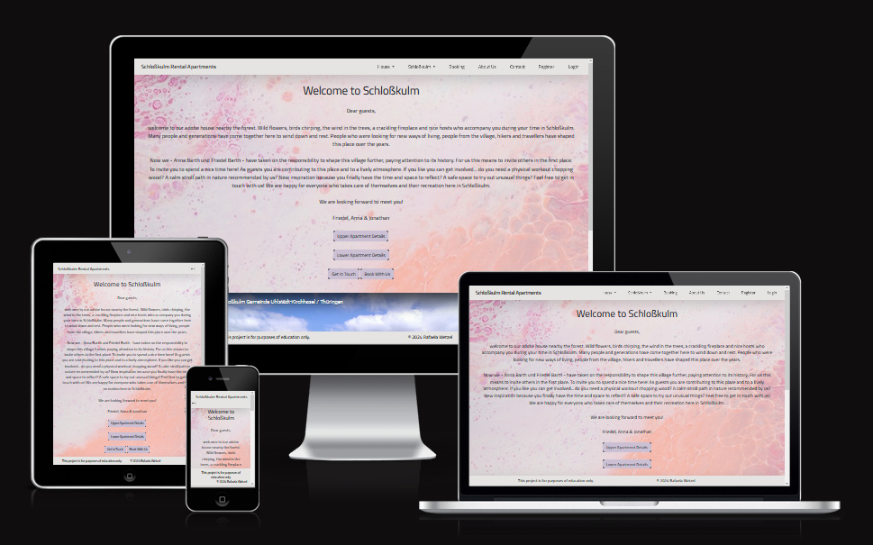  

[[Back to top]](#table-of-contents)

# Project Goals

## User Goals

- Read accomodation information to see if it fits guests' individual needs
- See accomodation and village / surrounding area pictures to get a visual impression
- Find information about activities and sights
- Find check-in and check-out times
- Find contact information to get in touch
- Find information about pricing
- Make a booking
- See booking details  

[[Back to top]](#table-of-contents)

## Site Owner Goals

- Present accomodation facilities and area in & around Schloßkulm in a nice and appealing way to attract guests
- Log in to see an overview of all bookings on the homepage interface as well as in the admin panel
- See each bookings' specific details on the homepage interface as well as in the admin panel
- Confirm, cancel or delete the individual bookings on the homepage interface as well as in the admin panel
- Receive guest messages if specific questions come up that are not answered on the homepage  

[[Back to top]](#table-of-contents)

# User Experience

## Target Audience

The target audience is...

- visitors from Germany who like to travel / are planning a vacation
- people who want to take some time off in a quiet area and enjoy nature
- families who want a big space that offers enough room for everyone and for their children to play
- couples who want to enjoy a romantic weekend in intimate togetherness
- couples or families that are looking for a pet-friendly accomodation
- hiking groups that are looking for a place to stay overnight
- private groups or companies that are looking for a seminar space with accomodation facilities
- groups looking for a space to organize a working retreat  

[[Back to top]](#table-of-contents)

## User Stories

- As a user I can easily find the most important information about the apartments so I can decide if it fits my needs.
- As a user I can see what the house can be used for in general (apart from renting it for vacation) so I can possibly rent it for other activities / contexts.
- As a user I can read about the house rules so I know what to be considerate of.
- As a user I want to know more about the locations surrounding area so I can plan activities for my vacation.
- As a user I want to have practical information so I do not specifically have to ask the hosts or research on my own.
- As a user I can see photo galleries on the homepage that give me a visual impression of the house and its surroundings.
- As a user I can easily find a contact form so I can get answers to my specific questions.
- As a user I am informed that I need to create an account to make a booking.
- As a user I can easily find a form to book the apartment(s) / house once I have created an account.
- As a user I am getting feedback if I have left any field in the forms blank.
- As a user I can see my booking details and the current booking status.
- As a user I can easily cancel my booking. 

[[Back to top]](#table-of-contents)

## Strategy  

The objective of the project is to design an apartment booking homepage to fulfill my customers needs and to attract potential guests. The homepage is simple in structure and design, and supposed to be appealing to townspeople.  

It should be easy to...  
- navigate
- find necessary information about the apartments and area
- make a booking   

[[Back to top]](#table-of-contents)

## Scope

  

Above is the first structural homepage draft. A while into the work on the project I realized the initial scope would be too comprehensive for my PP4 project, so I scaled it down to the most important features. 

Those are:

- a start page
- upper and lower apartment pages
- renting the whole house page
- house rules page
- day trips page
- gallery page
- location page
- booking form page
- your bookings page
- all bookings page
- about us page
- contact page 
- signup, login and logout features (django allauth)

The left-out features to be implemented for my client in future are:

- legal info (imprint, terms and conditions, data privacy)
- links to friends' pages / initiatives
- directions to and from location
- project archive  

[[Back to top]](#table-of-contents)

## Structure

The homepage is split up into five main navigation elements: House, Schloßkulm, Booking, About Us and Contact. The House section includes Lower Apartment, Upper Apartment, Rent House and House Rules. Schloßkulm includes Day Trips, Gallery and Location. Booking includes - once a user is logged in - Booking Form, All Bookings (hosts) or Your Bookings (guests). There are three separate pages / functionalities for registration, login and logout with their respective action confirmation pages.  

### Homepage overview

1. **Main Page**: start page with a welcome greeting and a Schloßkulm video from birds eye perspective
2. **House**:
    - **Upper Apartment**: informational page including general remarks, information about apartment facilities, important information about fire protection rules, check-in and check-out times, gallery and pricing
    - **Lower Apartment**: informational page including general remarks, information about apartment facilities, important information about fire protection rules, check-in and check-out times, gallery and pricing
    - **Rent House**: information about renting the whole house for various intended purposes and house infrastructure
    - **House Rules**: information about the house rules and its distinctive features
3. **Schloßkulm**:
    - **Day Trips**: suggestions for local activities and links to places of interest
    - **Gallery**: gallery with pictures of the house and village / surroundings
    - **Location**: information about the village and surrounding area including a Google Map
4. **Booking** (login necessary):
    - **Booking Form**: login functionality to make a booking via a booking form
    - **Your Bookings (guests)**: guests can see their booking details - possibility to cancel bookings
    - **All Bookings (hosts)**: hosts can see all booking details - possibility to confirm, cancel or delete bookings
5. **About Us**: about us page introducing the apartment hosts, including pictures
6. **Contact**: contact page with a form to get in touch (no login necessary)
7. **Register / Login / Logout**: User needs to register & login to make a booking and to see own bookings, if available. Login and logout navigation leads to a confirmation page.  

[[Back to top]](#table-of-contents)

## Skeleton

### Wireframe

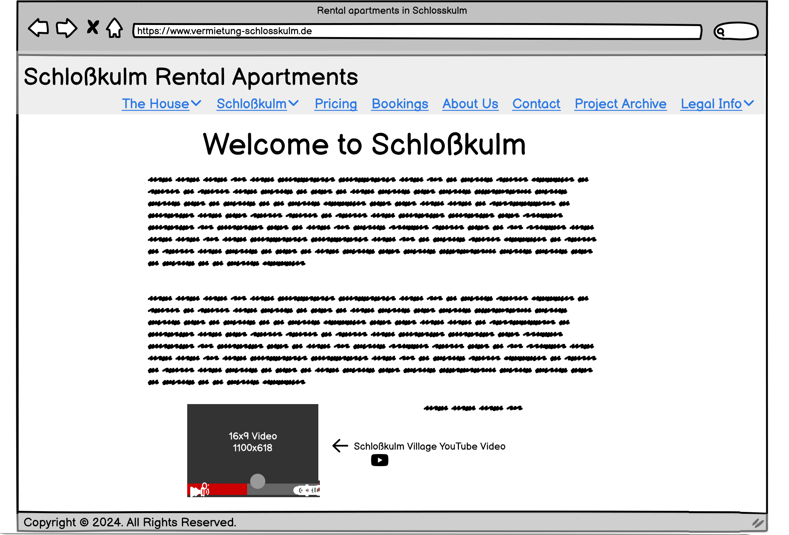  

  

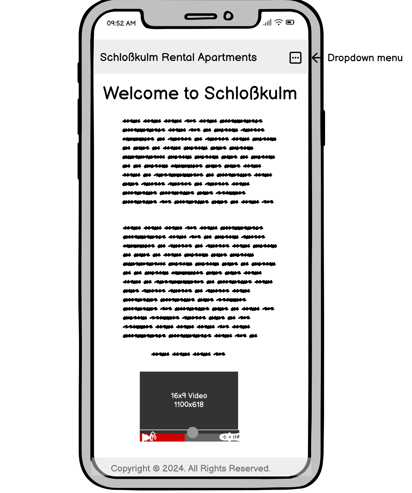  

Differences to the final outcome:  
- Scope within navigation menu has been scaled down as explained above  

[[Back to top]](#table-of-contents)

## Surface

Discussing design visions with my client the request was to create a simple design involving pastel colors and a non-intrusive font. I chose a background image in the colors light rose, dark rose, light purple and nude. There are some unobtrusive patterns on the sides that resemble a dotted structure as well as the reflection of water. Personally I perceive the colors and patterns as modern and refreshing which suits well the urban area target audience. The header and footer are held in light greyish colors making the background image the focus of attention in terms of design.  

[[Back to top]](#table-of-contents)

### Color Palette

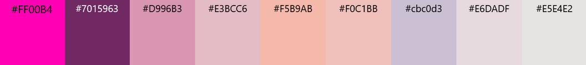  

[[Back to top]](#table-of-contents)

## Accessibility

To make the homepage more accessible to a wider audience of users I have, amongst other things, taken into account the following:

- Ensure there is enough contrast between the font colors and background colors
- Include individual page titles for every page
- Include alt text for every image
- Include iframe titles

### Lighthouse Report 

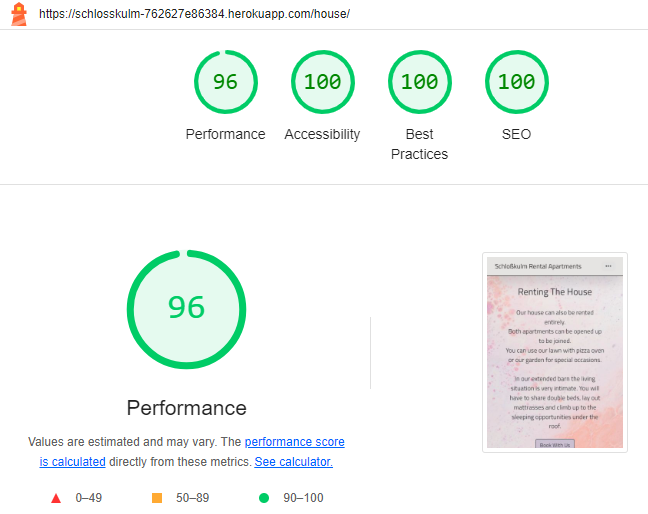

The average across all pages is:
- **Performance**: 92,38
- **Accessibility**: 99,69
- **Best Practices**: 96,46
- **SEO**: 100  

[[Back to top]](#table-of-contents)

# Technologies

- Lucidchart for creating first visual drafts of the homepage structure and its ERD 
- HTML, CSS and Bootstrap for creating and styling the homepage interface
- JavaScript for creating the confirm, cancel and delete booking functionality
- Python & Django for creating apps, the database, login functionality etc.
- Heroku for deploying the project to a live page
- GitHub for storing the code externally  

[[Back to top]](#table-of-contents)

# Libraries

I used the following libraries:

- Python os module was used to set environment variables in settings.py
- Crispy-bootstrap5 was used for the booking and contact form
- Dj-database-url was used to utilize the DATABASE_URL environment variable
- Django-allauth was used for authentication, registration and account management
- Gunicorn was used for the Python WSGI HTTP Server
- Psycopg2 was used as a PostgreSQL database adapter
- Requests was used as HTTP library for Python
- Sqlparse was used as a non-validating SQL parser for Python
- Summernote was used as a WYSIWYG editor with Bootstrap
- Whitenoise was used as a simplified static file serving for Python web apps
- Django-bootstrap-datepicker-plus for displaying date pickers in the booking form   

[[Back to top]](#table-of-contents)

# Features: Homepage Structure 

## Main Page

### Navigation Bar

  

The navigation bar is showing the apartment title **"Schloßkulm Rental Apartments"** to the left which leads back to the main page when clicking on it. The other navigation menu elements **House, Schloßkulm, Booking, About Us, Contact, Register / Login / Logout** are placed horizontally next to each other. The navigation elements **House, Schloßkulm** and (for logged in users) **Booking** are collapsed elements that open up and show other related sub-pages when clicking on them. The nav elements' font size grows bigger when hovering over them as well as there is a mouse symbol change so the user knows where they currently are. Once a collapsed nav element opens up there is also a background color change from white to purple when hovering over the related sub-pages. If a guest user has logged in and placed a booking the **Booking** nav element turns into a collapsed element that shows **Booking Form** and **Your Bookings** pages. If a guest user has not made a booking yet the **Booking** nav element will not show a collapsible effect until they have placed a booking. If a superuser is logged in, **Booking Form, Your Bookings** and additionally **All Bookings** becomes visible under the collapsible **Booking** nav element.  

[[Back to top]](#table-of-contents)

### Welcome Text

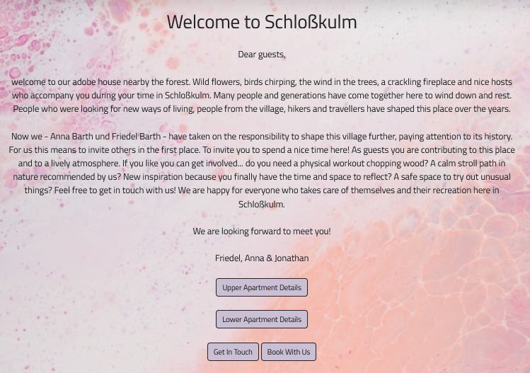  

On the main page the guest is greeted with a **"Welcome to Schloßkulm"** heading and a welcome text written by the hosts. Below the text there are some action buttons that lead to the most important pages - the **Apartment, Contact** and **Booking** pages. Hovering over the buttons leads to a background color change from purple to grey and font color from black to white. Clicking the **Book With Us** button as non-logged in user opens up a modal that informs them that they need to be logged in to make a booking. Clicking 'ok' leads them to the login page, clicking 'close' closes the modal. A logged-in user is directed to the **Booking Form** page immediately. Below the buttons there is a muted embedded YouTube video that shows a drone flight over the village of Schloßkulm to give the user an impression of how the area looks like.  

[[Back to top]](#table-of-contents)

### Footer

  

The footer shows two or three elements depending on the user login status. If the user is not logged in they will only see **This project is for purposes of education only.** and **© 2024 Rafaela Wetzel**. Once they have logged in their login status will be reflected to the left: **Logged in as: user xyz**. When the window is 575px or lower the three elements transversely stack on top of each other to fit the screen width.  

[[Back to top]](#table-of-contents)

## House Section  

### Upper And Lower Apartment Sections

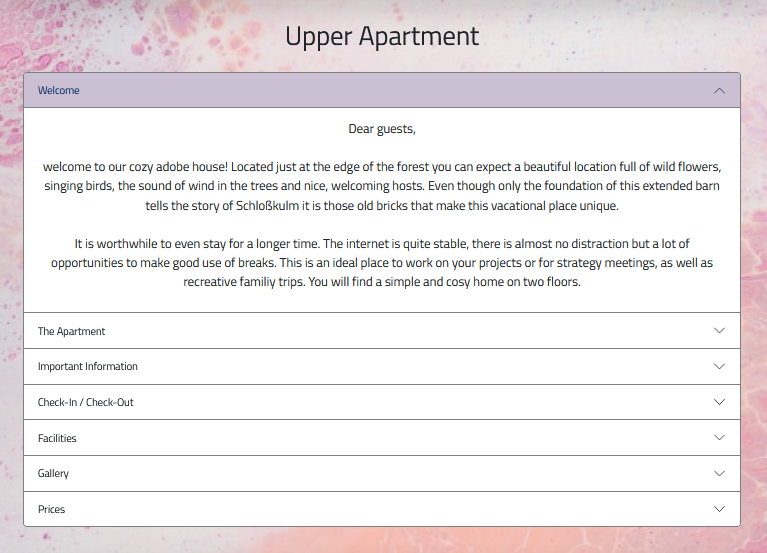  

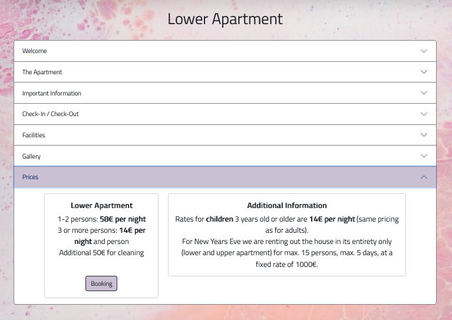  

The extensive information about the apartments is placed within collapsed accordions so the user can better navigate the different sections to find the information they are looking for. The accordion shows the following sections / titles: **Welcome, The Apartment, Important Information, Check-In / Check-Out, Facilities, Gallery** and **Prices.** Clicking on any of those sections opens up the corresponding text paragraph and displays the information. The user receives feedback to their action when clicking on a heading in the accordion which then changes color from white to purple adding a light blue border around it. Clicking on a second section closes the first one and opens the second one.  

- The first two sections **Welcome** and **The Apartment** display a general welcome text and tell the user about the accomodations characteristics, directions to find the right apartment, what is included in the booking and the different apartments capacities.  

- The section **Important Information** mainly is about informing the guest about preventive fire protection rules and guidance about smoking and lighting candles which is especially important for a house not made of bricks but adobe and wood. 

- **Check-In / Check-Out** displays the times the guest can enter and must leave the apartment before and after their stay.  

- **Facilities** lists the accomodation facilities such as specific kitchenware the guest can use and information about the internet connection.  

- The **Gallery** section shows a range of photos from inside of the house that each contain a one-line description. Clicking on any of the photos opens them in a bigger size in a new window.  

- The last section **Prices** displays the costs per person and night including a **Booking** button that leads to either a login page or the respective **Booking Form** (same modal functionality as described on the main page).  

[[Back to top]](#table-of-contents)

### Rent House Section

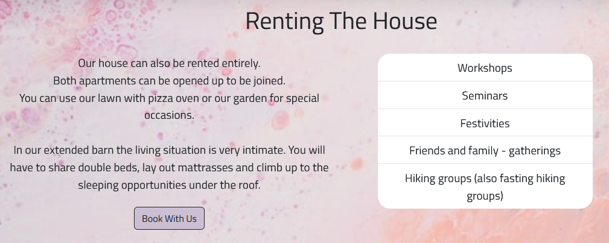 

This section informs the guest what else the house can be rented for besides vacational purposes, such as e.g.seminars and festivities. It also features a **Booking** button as included on the main and apartment pages.  

[[Back to top]](#table-of-contents)

### House Rules Section

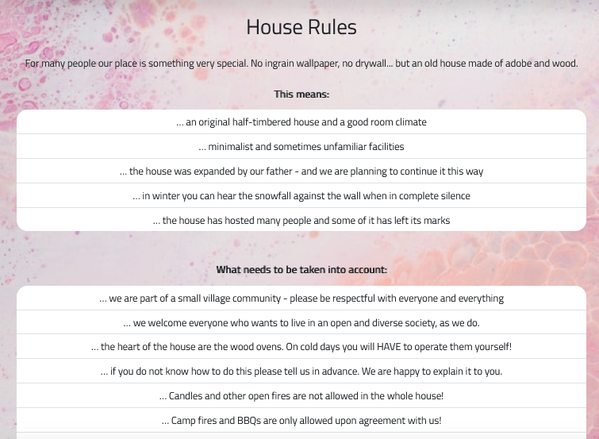  

The **House Rules** section is about mentioning the specific accomodation characteristics and things one should know / take into account before booking. The information is displayed within lists with a white background so they stick out from the light pink background.  

[[Back to top]](#table-of-contents)

## Schloßkulm Section

### Day Trips Section

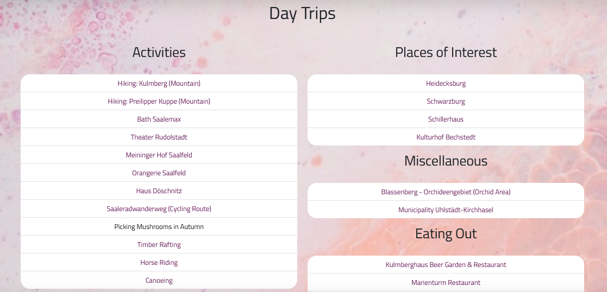  

The **Day Trip** section includes recommendations for **Activities, Places of Interest, Miscellaneous** and **Eating Out**. Each of these sub-sections is displayed as list with white background. Hovering over the links changes the background color from white to light purple and clicking on any of them opens a page in a new window.  

[[Back to top]](#table-of-contents)

### Gallery Section

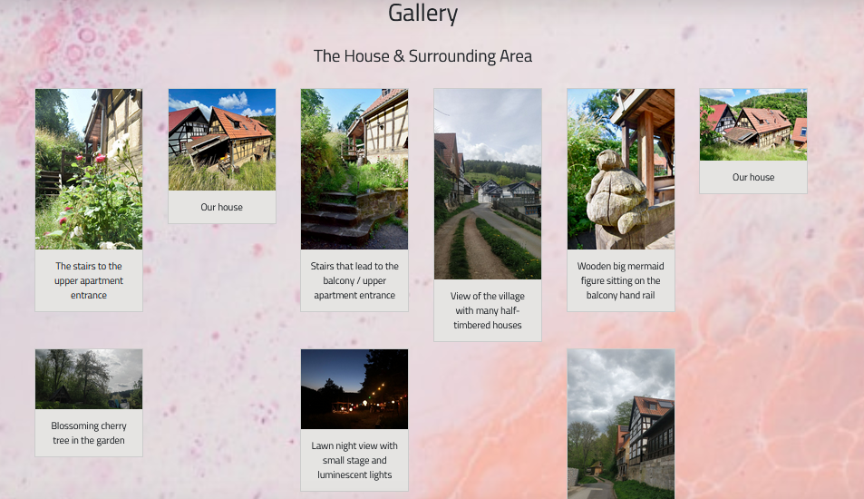  

The **Gallery** features two image sections: **The House & Surrounding Area** show pictures from the outside of the house and garden. Each picture has a one-line description below. The **Schloßkulm - Village and Nature** section shows pictures of the village, landscape and nature. Each of the pictures is placed within a light-grey rectangle box that displays a thin black border when hovering over. Clicking on any of them opens a bigger picture in a new window.  

[[Back to top]](#table-of-contents)

### Location Section

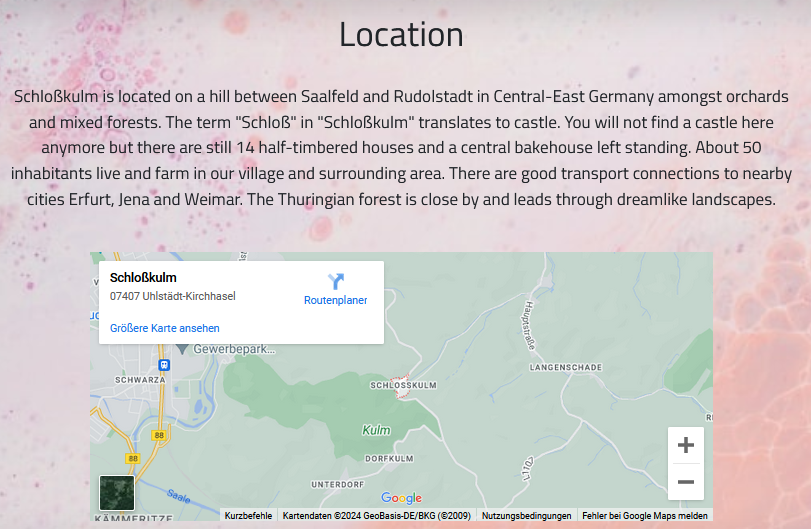  

The **Location** section shares information about the area, village history and includes a Google Map showing its location.  

[[Back to top]](#table-of-contents)

## Booking Section

### Booking Form Section

 
   

The **Booking Form** page is accessible to logged-in users only. Clicking on the navigation element as non-logged in user redirects them to the login page. The **Booking** page includes a booking form for the guest to either book the lower/upper apartment or whole house. More information about the included form fields can be found in the [**Booking Model**](#booking-model) section. Out of the 17 form fields 15 are mandatory to fill in. If any of the 15 are left out the window will jump back to the left out field prompting the user to fill it out before they can place the booking via the 'submit' button at the very bottom. With the birth, arrival and departure date fields also comes date validation. There will be validation errors shown at the top if the user enters a birth date that lies in the future, if the arrival and departure dates are on the same day or in the past, or if the arrival date is after the departure date. The validation errors at the top are shown within a rectangle box with light red background so it catches the users eye. If the user successfully submits a booking they will be redirected to the main page showing a confirmation message at the top: *"Thank you for your booking request. We will be in touch with you soon."*  

[[Back to top]](#table-of-contents)

### Your Bookings Section

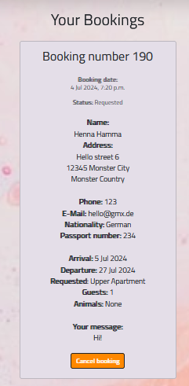
 

Once a guest user has placed a booking the **Your Bookings** sub-page will become visible in the navigation menu under **Booking**. Each booking is displayed in a Bootstrap card with a light grey background so the bookings can more easily visually be distinguished from each other. The booking card includes the unique booking number, booking date and booking status at the top; below the information the user entered in the booking form is displayed. For each new booking the booking status is set to 'requested' per default. For guests there is a cancel functionality in form of a **Cancel Booking** button at the very bottom. Hovering over the button changes its background color from light purple to bright signal orange and its font color from black to white. Clicking the cancel button opens up a defensive programming modal that asks for a confirmation: *"Are you sure you want to cancel your booking? This action cannot be undone."* Clicking 'close' closes the modal and clicking 'cancel booking' refreshes the page, setting the booking status from 'requested' to 'cancelled' in the booking card. A confirmation message is shown as well at the very top: *"Booking no. x has been cancelled!"*. After this action no action buttons are visible any longer at the bottom of the card. I have chosen not to include a 'delete' button for guests because I want the hosts to have full control over the entered data if they should need it for bookkeeping later on.

The **Your Bookings** page is visible for guests and also for hosts should they receive a booking verbally so they can manually enter the booking data for the guest. 

If a non-logged-in user tries to access the page via direct link input they will read the information *"You are not authorized to view this page" in a pop-up modal and being redirected to the main page.*  

[[Back to top]](#table-of-contents)

### All Bookings Section

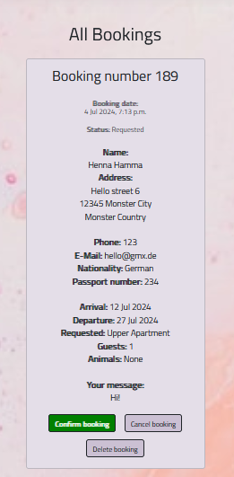  

The **All Bookings** section is quite similar to the **Your Bookings** section. This sub-page is only visible to superusers / hosts so they can see and manage all bookings by all guests from one place. The difference to the **Your Bookings** page is that **All Bookings** features extended functionality to manage the bookings. Next to the 'cancel booking' button there is also a 'confirm booking' button (changes to green background color when hovering over and grows slightly bigger) and 'delete booking' button (changes to red and gets bigger). The modal confirmation procedure and confirmation message at the top is the same as described above for the 'cancel booking' functionality in **Your Bookings** for the confirm and delete buttons. Once a booking has been confirmed or cancelled the respective button disappears from the card. The delete functionality removes the booking from the database entirely.   

If a non-logged-in user tries to access the page via direct link input they will read the information *"You are not authorized to view this page" in a pop-up modal and being redirected to the main page.* 

[[Back to top]](#table-of-contents)

## About Us Section

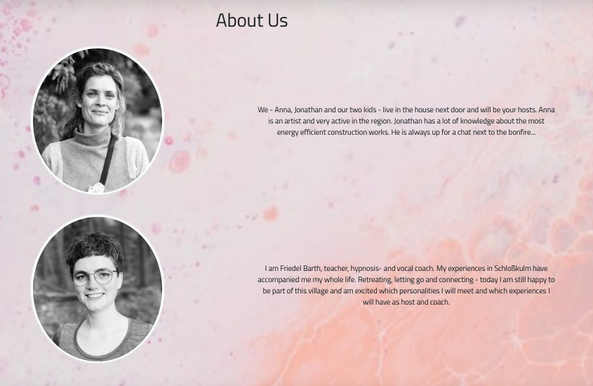  

The **About Us** section shows the two apartment hosts Anna and Friedel. There is a black-white profile picture and short persona description for each of them so the guests have a better impression of who will be welcoming them in Schloßkulm.  

[[Back to top]](#table-of-contents)

## Contact Section

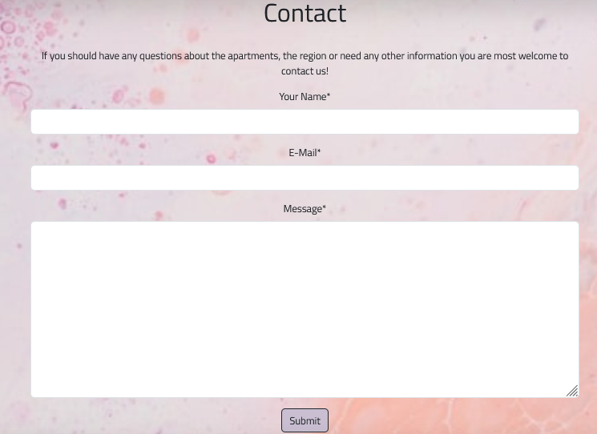  

The **Contact Section** contains a contact form for logged-in and non-logged in guests to get in touch. More about the contact model can be read [here](#contact-model). Each of the three fields is mandatory and leaving any of them empty prompts the user to fill them in. There is user feedback in form of a blue border around each form field when clicked on and the submit button changing its color when hovering over. Successfully submitting a message redirects the user to the main page and shows a confirmation message: *"Thank you for your message. We will be in touch with you soon."*  

[[Back to top]](#table-of-contents)

# Database Models

## Entity Relationship Diagram

  

[[Back to top]](#table-of-contents)

## Booking Model  

The booking model is for the guests to make an apartment booking. The data is collected to check the respective apartment availability, contact the guest, have all the information to create an invoice and gather data in line with the German tourist registration form [(Federal Act on Registration)](https://www.gesetze-im-internet.de/englisch_bmg/englisch_bmg.html) that, amongst other details, asks for the guests passport number if the residency is any other than German. 

The visible fields are:
- first name*
- last name*
- birth date*
- email*
- phone number*
- address*
- zip code*
- city*
- country*
- booking item* *(Lower Apartment, Upper Apartment, Whole House)*
- arrival date*
- departure date*
- amount guests* *(1-15)*
- nationality* *(German or other)*
- passport number *(relevant if guest has a nationality other than German)*
- animals
- message*

**mandatory field* 

Next to the visible fields on the booking form page there is also other information collected and stored in the database that is either visible in the admin panel and/or on the your bookings and all bookings pages:

- user id (foreign key that is connected to the user model - visible in admin panel)
- booking number (visible in admin panel and your/all bookings page)
- booking date and time (visible in admin panel and your/all bookings page)
- booking status *(requested (per default), confirmed or cancelled* - visible in admin panel and your/all bookings page)

The user id serves as foreign key in the booking model to the user models primary key and represents a many-to-one relationship (one user can make many bookings).  

[[Back to top]](#table-of-contents)

## Contact Model

The contact model is for guests to get in touch with the hosts should they have any remaining questions that are not answered on the homepage. The contact form is accessible to both logged-in and non-logged-in users. 

The fields are:
- name*
- email*
- message*

**mandatory field*  

[[Back to top]](#table-of-contents)

# Features Left to Implement  

- Automatically send confirmation e-mail to host and guest when a booking has been made, confirmed, cancelled or deleted
- Include a booking availability calendar
- Interface between database and LexOffice to create invoices  
- Add cancellation policy

[[Back to top]](#table-of-contents)

# Testing 

I have tested the responsiveness of my homepage with Firefox and Google Chrome Dev Tools and checked the following screen sizes: 360px (Galaxy S8 on DevTools and my own mobile phone Moto G50), 576px, 768px, 992px and 1200px (DevTools and my own laptop Lenovo ThinkPad X260). I confirm that the actions below work on all screen sizes.  

[[Back to top]](#table-of-contents)

## Manual Testing  

| Section Tested | Input To Validate / Functionality To Test | Expected Outcome | Actual Outcome | Pass/Fail |
| -------------- | ----------------- | ---------------- | -------------- | --------- |
| Main Page | Clicking 'play' button on video | Starts muted YouTube video | As expected | Pass |
| Main Page | Clicking 'Schloßkulm Rental Apartments' in the top left | Redirects to start page | As expected | Pass |
| Main Page | Clicking navigation menu elements | Direct to respective pages | As expected | Pass |
| Upper Apartment Section | Clicking on accordion sections | Respective section opens up | As expected | Pass |
| Upper Apartment Section | Clicking on another accordion section whilst one section is already open | Respective new section opens up and the previous one closes | As expected | Pass |
| Upper Apartment Section - Gallery | Clicking on single pictures | Bigger sized picture opens in a new window | As expected | Pass |
| Upper Apartment Section - Prices | A non-logged in user clicks the 'booking' button | A modal opens up that tells them that it is necessary to be logged in to make a booking | As expected | Pass |
| Upper Apartment Section - Prices | Clicking 'close' in modal window | Closes modal | As expected | Pass |
| Upper Apartment Section - Prices | Clicking 'ok' in modal window | Redirects to login page | As expected | Pass |
| Upper Apartment Section - Prices | Logging in after being redirected from prices section | Redirects to booking page | As expected | Pass |
| Upper Apartment Section - Prices | A logged in user clicks the 'booking' button | Redirects to booking page | As expected | Pass |
| Lower Apartment Section | Clicking accordion sections | Respective sections open up | As expected | Pass |
| Lower Apartment Section | Clicking on another accordion section whilst one section is already open | Respective new section opens up and the previous one closes | As expected | Pass |
| Lower Apartment Section - Gallery | Clicking on single pictures | Bigger sized picture opens in a new window | As expected | Pass |
| Lower Apartment Section - Prices | A non-logged in user clicks the 'booking' button | A modal opens up that tells them that it is necessary to be logged in to make a booking | As expected | Pass |
| Lower Apartment Section - Prices | Clicking 'close' in modal window | Closes modal | As expected | Pass |
| Lower Apartment Section - Prices | Clicking 'ok' in modal window | Redirects to login page | As expected | Pass |
| Lower Apartment Section - Prices | Logging in after being redirected from prices section | Redirects to booking page | As expected | Pass |
| Lower Apartment Section - Prices | A logged in user clicks the 'booking' button | Redirects to booking page | As expected | Pass |
| Rent House Section | A non-logged in user clicks the 'booking' button | A modal opens up that tells them that it is necessary to be logged in to make a booking | As expected | Pass |
| Rent House Section | Clicking 'close' in modal window | Closes modal | As expected | Pass |
| Rent House Section | Clicking 'ok' in modal window | Redirects to login page | As expected | Pass |
| Rent House Section | Logging in after being redirected from prices section | Redirects to booking page | As expected | Pass |
| Rent House Section | A logged in user clicks the 'booking' button | Redirects to booking page | As expected | Pass |
| Day Trips Section | Clicking individual links | Opens respective page in a new window | As expected | Pass |
| Gallery Section | Clicking on single pictures | Bigger sized picture opens in a new window | As expected | Pass |
| Location Section | Clicking +/- within Google Map | Zooms in and out | As expected | Pass |
| Location Section | Clicking 'view bigger map' | Opens new Google Maps window showing bigger map | As expected | Pass |
| Booking Form Section | Clicking 'Booking' in navigation menu as non-logged in user | Redirects to login page | As expected | Pass |
| Booking Form Section | Signing in after being redirected from 'Booking' | Redirects to booking form page | As expected | Pass |
| Booking Form Section | Clicking 'Booking' in navigation menu as logged in user | Opens booking form page | As expected | Pass |
| Booking Form Section | Leaving any of the mandatory form fields blank | Booking is not processed yet and user is prompted to fill in the empty field(s) | As expected | Pass |
| Booking Form Section | Entering a non-email address in e-mail field | Message is not sent yet and user is prompted to enter an email address | As expected | Pass |
| Booking Form Section | Sending valid booking request | Redirects to main page and confirmation message is displayed: "Thank you for your booking request. We will be in touch with you soon." | As expected | Pass |
| Booking Form Section | Entering a birth date that lies in the future | Validation error: "Your birth date cannot be in the future!" | As expected | Pass |
| Booking Form Section | Entering the same date for arrival and departure | Validation error: "Your arrival date cannot be the same day as your departure date!" | As expected | Pass |
| Booking Form Section | Entering arrival or departure dates that are in the past | Validation error: "Your booking date cannot be in the past!" | As expected | Pass |
| Your Bookings Section | Logged in guest has sent a valid booking request | 'Your bookings' appears in navigation menu, booking appears on the 'your bookings' page & status is set to 'requested' | As expected | Pass |
| Your Bookings Section | Guest clicks on 'cancel booking' button | Modal appears | As expected | Pass |
| Your Bookings Section | Guest clicks on 'close' within modal | Modal closes, nothing else happens | As expected | Pass |
| Your Bookings Section | Guest clicks on 'cancel booking' button | Booking status is set to 'cancelled' and 'cancel booking' button disappears | As expected | Pass |
| All Bookings Section | Host logs in | 'All bookings' appears in navigation menu & host can see all bookings made so far | As expected | Pass |
| All Bookings Section | Host clicks on 'confirm booking' button | Modal appears | As expected | Pass |
| All Bookings Section | Host clicks on 'close' within modal | Modal closes, nothing else happens | As expected | Pass |
| All Bookings Section | Host clicks on 'confirm booking' button within modal | Booking status is set to 'confirmed', 'confirm booking' button disappears and message is displayed: "Booking no. x has been confirmed!" | As expected | Pass |
| All Bookings Section | Host clicks on 'cancel booking' button | Modal appears | As expected | Pass |
| All Bookings Section | Host clicks on 'close' within modal | Modal closes, nothing else happens | As expected | Pass |
| All Bookings Section | Host clicks on 'cancel booking' button within modal | Booking status is set to 'cancelled', 'cancel booking' button disappears and message is displayed: "Booking no. x has been cancelled!" | As expected | Pass |
| All Bookings Section | Host clicks on 'delete booking' button | Modal appears | As expected | Pass |
| All Bookings Section | Host clicks on 'close' within modal | Modal closes, nothing else happens | As expected | Pass |
| All Bookings Section | Host clicks on 'delete booking' button within modal | Booking is removed from database and confirmation message is displayed: "Booking no. x has been deleted!" | As expected | Pass |
| Contact Section | Leaving any of the mandatory form fields blank | Message is not sent yet and user is prompted to fill in the empty field(s) | As expected | Pass |
| Contact Section | Entering a non-email address in e-mail field | Message is not sent yet and user is prompted to enter an email address | As expected | Pass |
| Contact Section | User sends valid contact request | Redirects to main page & displays confirmation message: "Thank you for your message. We will be in touch with you soon." | As expected | Pass |
| Login Section | Logging in | Login status is reflected in footer: "Logged in as: User x" | As expected | Pass |  

[[Back to top]](#table-of-contents)

## Validator Testing

- I confirm that no errors were returned when passing through the [CI Python Linter](https://pep8ci.herokuapp.com/). The same result is valid for all Python files.

- I confirm that no errors were returned when passing through [JSHint](https://jshint.com/) for manage-bookings.js.

- I confirm that no errors were returned when passing through the [HTML validator](https://validator.w3.org/). The same result is valid for all pages.

- I confirm that no errors were returned when passing through the [CSS validator](https://jigsaw.w3.org/css-validator/).

  

[[Back to top]](#table-of-contents)

## Bugs & Problems

- On the allauth signup page I had a "Forbidden (403). CSRF verification failed. Request aborted. Reason given for failure: CSRF token from POST incorrect." error when trying to register a new user. This error did not appear during login or logout. It took me a while to figure out that the error occured due to the order within the signup.html. First the  was placed before "input type="hidden" name="csrfmiddlewaretoken" value="BBUZLiv[...]"
and after I placed it before the input field everything worked fine again.
      
- When trying to delete a booking as host via the delete button on the all-bookings page there was a bug that a specific booking, e.g. number 95, would be deleted but then a new booking with number 96 would appear on the page but not to be found in the database. I figured out that I still had booking.save() after booking.delete() in my Javascript delete_booking code.  

[[Back to top]](#table-of-contents)

## Unfixed Bugs

No unfixed bugs.  

[[Back to top]](#table-of-contents)

# Deployment

1. Add requirements for deployment in requirements.txt file
2. Log in to Heroku and create new app
3. Add Python and Nodejs Buildpacks
4. Go to deployment section and connect to GitHub account
5. Search for project repository and connect to Heroku
6. Deploy branch via manual deploy

The live project can be found here: https://schlosskulm-762627e86384.herokuapp.com/   

[[Back to top]](#table-of-contents)

# Credits 

## Code

[1] Login / logout / sign in - code for nav bar adapted from Django Blog walkthrough  

[2] Adding choice field to a model  
https://www.youtube.com/watch?v=iddMtHAV_N0  

[3] Displaying success alert message
https://stackoverflow.com/a/64242550/22894967  

[4] Adding date validators to model DateField
https://stackoverflow.com/a/49240469/22894967  

[5] Slack (and mentor) support for creating confirm / cancel / delete button functionality  
https://code-institute-room.slack.com/archives/C026PTF46F5/p1717615605849249?thread_ts=1717609357.373989&cid=C026PTF46F5  

[6] CSS Image Gallery  
https://www.w3schools.com/css/css_image_gallery.asp  

[[Back to top]](#table-of-contents)

## Tutorials 

[1] How to make YouTube videos responsive
https://yoast.com/how-to-make-youtube-videos-responsive/  

[2] How to remove Bootstrap nav bar toggler border  
https://stackoverflow.com/questions/50668594/remove-border-color-for-navbar-toggler-hamburger-icon-in-bootstrap-using-css 

[3] How to add custom CSS classes to form fields in Django Allauth
https://stackoverflow.com/a/21387794/22894967  

[4] How to redirect to previous page after login
https://stackoverflow.com/questions/63886066/redirect-back-to-previous-page-after-login-in-django-allauth  

[5] How to make the booking date visible in the admin panel  
https://stackoverflow.com/a/27679566/22894967 

[6] How to resize total size of an image  
https://stackoverflow.com/a/10752040/22894967  

[7] How to pop up modal automatically upon window load  
https://www.tutorialrepublic.com/faq/how-to-launch-bootstrap-modal-on-page-load.php  

[[Back to top]](#table-of-contents)

## Media

- Background image taken from [Unsplash](https://unsplash.com/de/fotos/luftaufnahme-des-ozeans-qztBRIrU1FM)
- Favicon: Schlosskulm coat of arms from [municipality homepage](https://www.uhlstaedt-kirchhasel.de/ortsteile/ ) 
- All house and surrounding area photos provided by apartment hosts Anna & Friedel Barth
- German homepage text provided by apartment hosts Anna & Friedel Barth, English translation by me  

[[Back to top]](#table-of-contents)

## Acknowledgements

- Help and feedback from my mentor Oluwafemi Medale
- Readme structure inspired by [hughes84](https://github.com/hughes84/hangman-pp3/blob/main/README.md)
- Library description taken from [ObiWanBonobi](https://github.com/ObiWanBonobi/PP4/tree/main?tab=readme-ov-file#libraries)  

[[Back to top]](#table-of-contents)